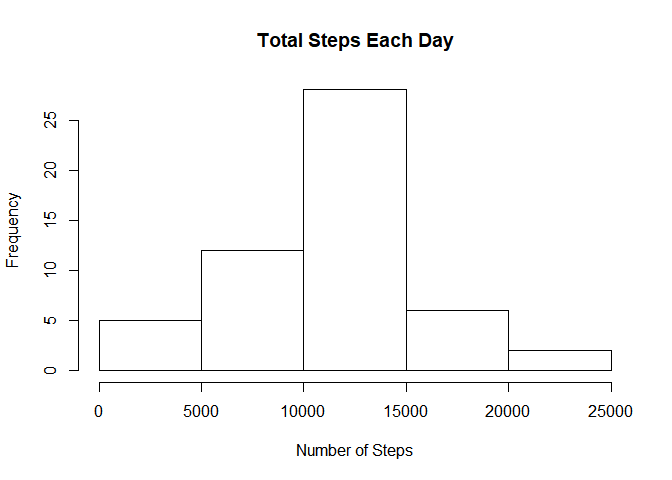
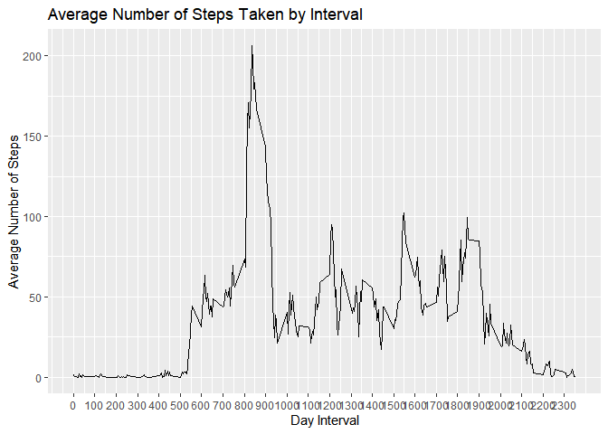
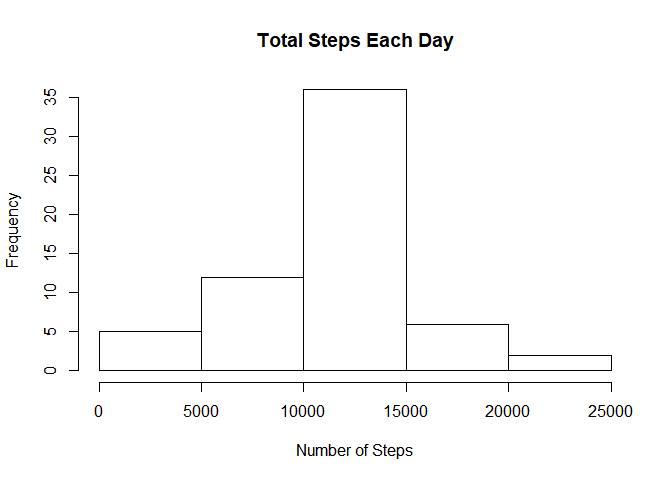

## Loading required packages

```r
library(dplyr)
```

```
## 
## Attaching package: 'dplyr'
```

```
## The following objects are masked from 'package:stats':
## 
##     filter, lag
```

```
## The following objects are masked from 'package:base':
## 
##     intersect, setdiff, setequal, union
```

```r
library(readr)
library(ggplot2)
```

## Loading the dataset

```r
data <- read.csv("activity.csv")
```

## What is mean total number of steps taken per day?

```r
# Calculate the total number of steps taken per day
steps_by_day <- aggregate(steps ~ date, data, sum)

# Create histogram of the total number of steps taken each day
hist(steps_by_day$steps, main = paste("Total Steps Each Day"), xlab="Number of Steps")
```

<!-- -->

```r
# Calculate and print mean
mean(steps_by_day$steps)
```

```
## [1] 10766.19
```

```r
# Calculate and print median
median(steps_by_day$steps)
```

```
## [1] 10765
```

## What is the average daily activity pattern?


```r
# Create a data frame of the mean and median number of steps across all days
actInterval <- data %>% dplyr::group_by(interval) %>% summarise(meanSteps = mean(steps, na.rm = TRUE))

# Generate time series plot of the intervals vs steps taken
IntervalPlot <- ggplot(
                      data = actInterval, 
                      mapping = aes(x = interval, y = meanSteps)) + 
                      geom_line() + 
                      scale_x_continuous("Day Interval",
                      breaks = seq(min(actInterval$interval), 
                                   max(actInterval$interval), 100)) +
                      scale_y_continuous("Average Number of Steps") + 
                      ggtitle("Average Number of Steps Taken by Interval"
                      )

IntervalPlot
```

<!-- -->

```r
# Which 5-minute interval, on average across all the days in the dataset, contains the maximum number of steps?

# Return the 5 minute interval of the highest steps
actInterval[max(actInterval$meanSteps),]
```

```
## # A tibble: 1 x 2
##   interval meanSteps
##      <int>     <dbl>
## 1     1705      56.3
```

## Imputing missing values

Note that there are a number of days/intervals where there are missing values (coded as NA). The presence of missing days may introduce bias into some calculations or summaries of the data.


```r
# Calculate and report the total number of missing values in the dataset (i.e. the total number of rows with NA)
summary(is.na(data))
```

```
##    steps            date          interval      
##  Mode :logical   Mode :logical   Mode :logical  
##  FALSE:15264     FALSE:17568     FALSE:17568    
##  TRUE :2304
```
Total number of NA's in the dataset is 2304. All of these are in the steps field.

To remove the bias of NA's I will be replacing all na's with the mean for that 5 minute interval. This data is already stored in my 'actInterval' data frame created earlier.

```r
# Create a new dataframe with a lookup/merge against the mean
datawithmean <- merge(data, actInterval, by.x = "interval")

# Replace NA's in steps with the mean value from that interval
datawithmean$steps[is.na(datawithmean$steps)] <- datawithmean$meanSteps[is.na(datawithmean$steps)]

# Rerun the NA check to ensure the NAs have been replaced
summary(is.na(datawithmean))
```

```
##   interval         steps            date         meanSteps      
##  Mode :logical   Mode :logical   Mode :logical   Mode :logical  
##  FALSE:17568     FALSE:17568     FALSE:17568     FALSE:17568
```

Next I will rerun the above histogram and return the mean/median values with the new dataset. This will highlight any differences that the NA's made.

```r
# Calculate the total number of steps taken per day
steps_by_day2 <- aggregate(steps ~ date, datawithmean, sum)

# Create histogram of the total number of steps taken each day
hist(steps_by_day2$steps, main = paste("Total Steps Each Day"), xlab="Number of Steps")
```

<!-- -->

```r
# Calculate and print mean
mean(steps_by_day2$steps)
```

```
## [1] 10766.19
```

```r
# Calculate and print median
median(steps_by_day2$steps)
```

```
## [1] 10766.19
```
I can see that the NA's have slightly increased the median value. However the mean stays the same.

## Are there differences in activity patterns between weekdays and weekends?


