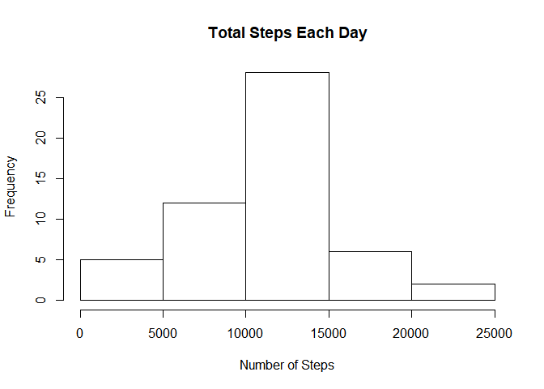
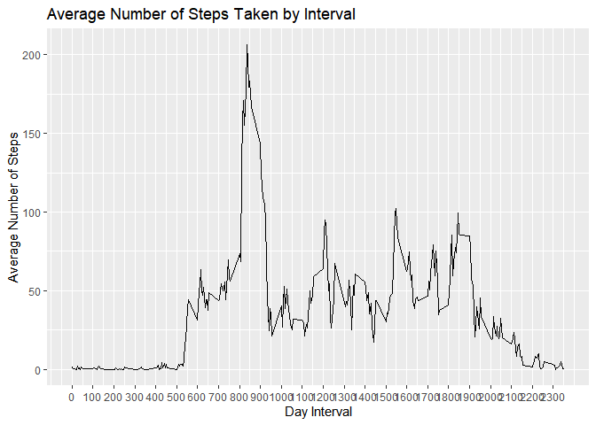

## Loading required packages

```r
library(dplyr)
```

```
## 
## Attaching package: 'dplyr'
```

```
## The following objects are masked from 'package:stats':
## 
##     filter, lag
```

```
## The following objects are masked from 'package:base':
## 
##     intersect, setdiff, setequal, union
```

```r
library(readr)
library(ggplot2)
```

## Loading the dataset

```r
data <- read.csv("activity.csv")
```

## What is mean total number of steps taken per day?

```r
# Calculate the total number of steps taken per day
steps_by_day <- aggregate(steps ~ date, data, sum)

# Create histogram of the total number of steps taken each day
hist(steps_by_day$steps, main = paste("Total Steps Each Day"), xlab="Number of Steps")
```

<!-- -->

```r
# Calculate and print mean
mean(steps_by_day$steps)
```

```
## [1] 10766.19
```

```r
# Calculate and print median
median(steps_by_day$steps)
```

```
## [1] 10765
```

## What is the average daily activity pattern?


```r
# Create a data frame of the mean and median number of steps across all days
actInterval <- data %>% dplyr::group_by(interval) %>% summarise(meanSteps = mean(steps, na.rm = TRUE))

# Generate time series plot of the intervals vs steps taken
IntervalPlot <- ggplot(
                      data = actInterval, 
                      mapping = aes(x = interval, y = meanSteps)) + 
                      geom_line() + 
                      scale_x_continuous("Day Interval",
                      breaks = seq(min(actInterval$interval), 
                                   max(actInterval$interval), 100)) +
                      scale_y_continuous("Average Number of Steps") + 
                      ggtitle("Average Number of Steps Taken by Interval"
                      )

IntervalPlot
```

<!-- -->

```r
# Which 5-minute interval, on average across all the days in the dataset, contains the maximum number of steps?

# Return the 5 minute interval of the highest steps
actInterval[max(actInterval$meanSteps),]
```

```
## # A tibble: 1 x 2
##   interval meanSteps
##      <int>     <dbl>
## 1     1705      56.3
```

## Imputing missing values


## Are there differences in activity patterns between weekdays and weekends?
